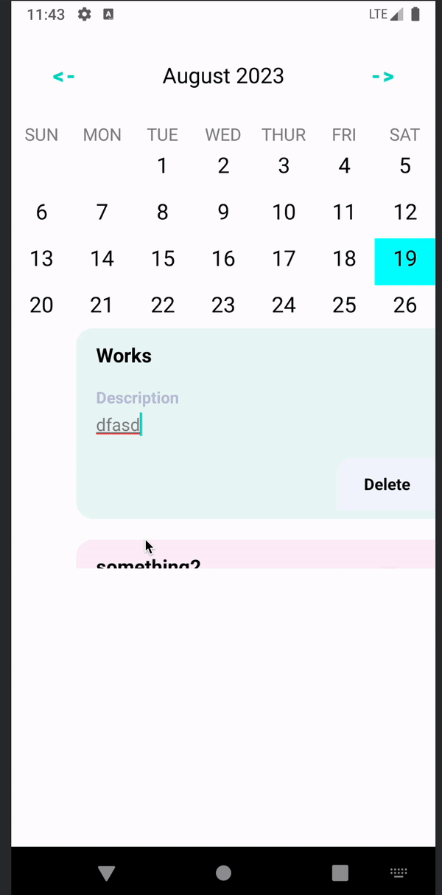
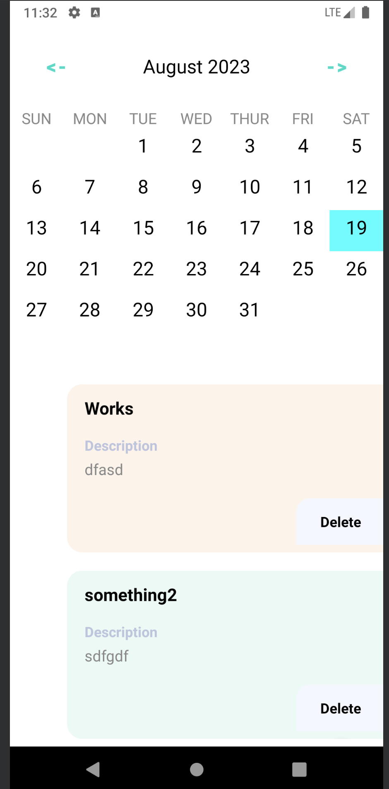
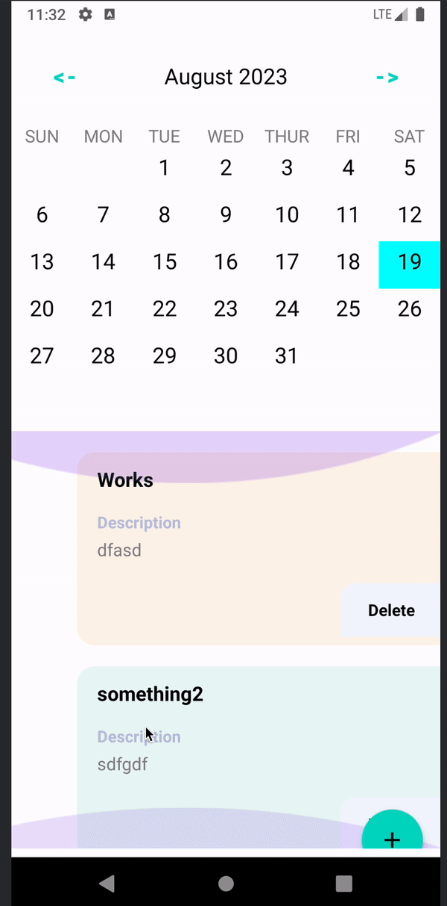

# Frnd
## About
An app where you can add a task for a day and check if any tasks are pending or not.
- It is offline capable 😃
- Clean and Simple Material UI.

## Build with 🛠
- Kotlin
- Android Architecture Components - Collection of libraries that help you design robust, testable, and maintainable apps.
    - LiveData - Data objects that notify views when the underlying database changes.
    - ViewModel - Stores UI-related data that isn't destroyed on UI changes.
    - Room - SQLite object mapping library.
    - Custom View - Custom Calendar View, No Dependency used
- Repository Pattern
- MVVM
- Single Activity
- Coroutines
- Clean Architecture

### Glance On Project
#### 1. Saving Editing States for Task

#### 2. Starting Of the APP

#### 3. Scroll Behaviour or FAB

